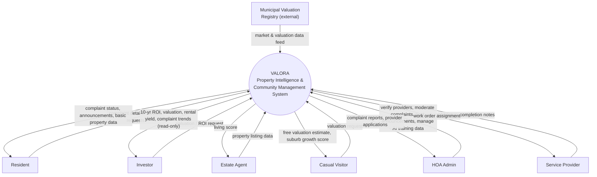
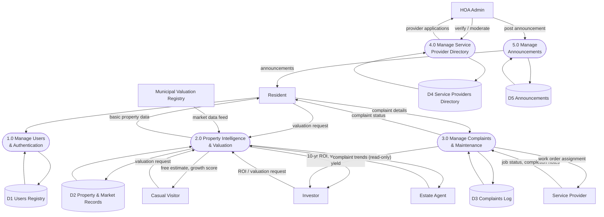
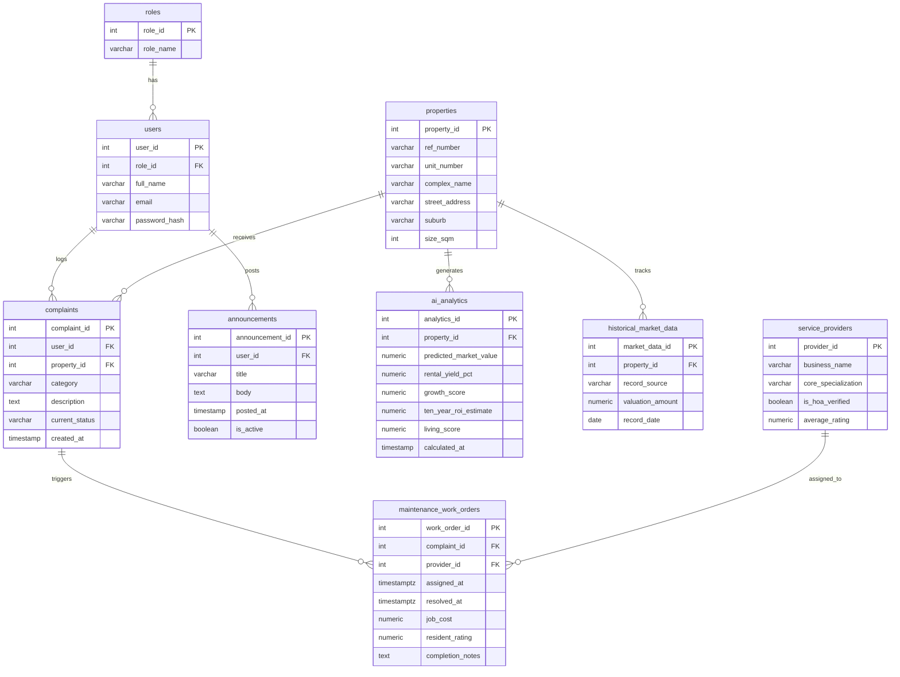
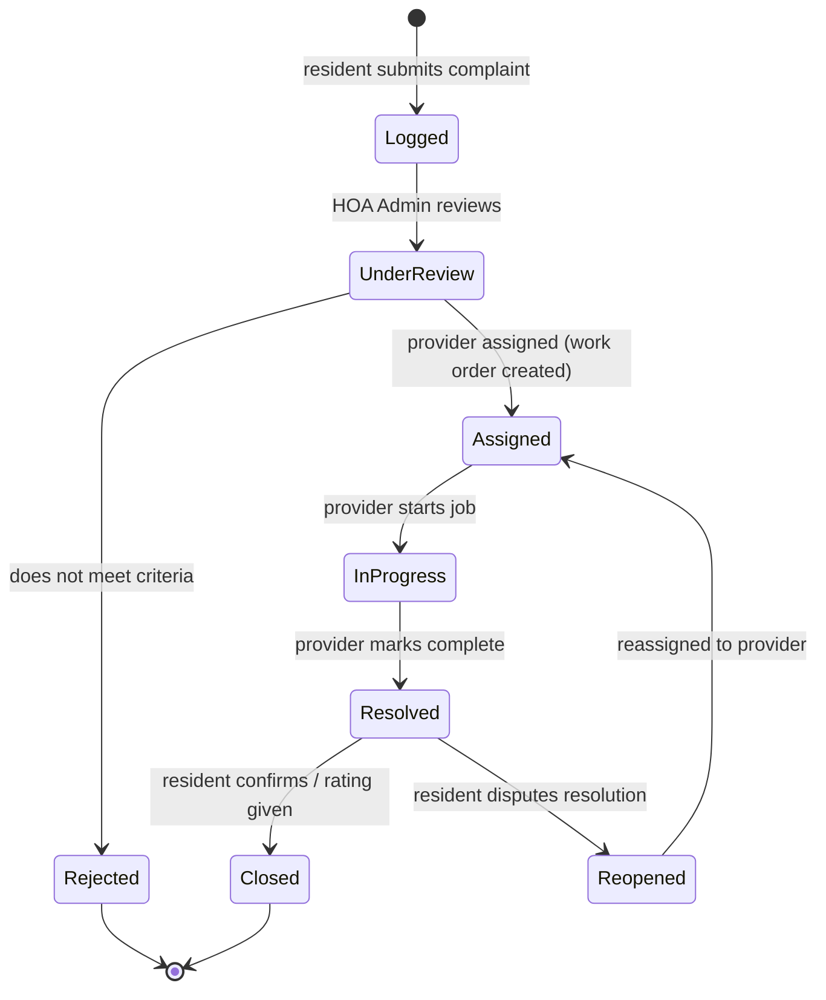
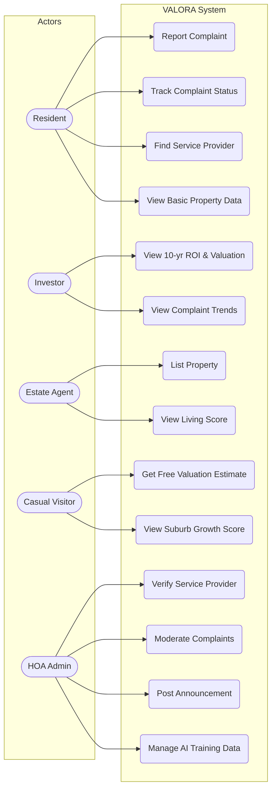

# VALORA — 3.8 Data Modeling for Proposed System (Mermaid → draw.io)

How to use: In draw.io, go to **Extras > Edit Diagram**, paste one code block at a
time (with the ```mermaid fences removed), pick **Mermaid** as the type, and hit
**OK**. Each diagram below is independent — import them onto separate pages.

All fixes from the technical review have been applied and are flagged inline
with `%% FIX #n` comments (remove these comments before final submission if
your supervisor wants clean diagrams).

---

## 1. Context Diagram (Level 0)



---

## 2. Level 1 Data Flow Diagram



---

## 3. Entity Relationship Diagram



**Fixes applied to the ERD:**
- `announcements` entity added (FIX #2), linked to `users` via `posts`
- `historical_market_data` cardinality corrected from `||--|{` to `||--o{` (FIX #4) — a property can have zero historical market records, not mandatory one-or-more
- `living_score` attribute added to `ai_analytics` (FIX #5)
- `created_at` timestamp added to `complaints` (FIX #6)

---

## 4. State Transition Diagram (Complaint Lifecycle)



---

## 5. Use Case Diagram

Mermaid has no native UML use-case notation, so this is modeled as a
flowchart (actors as stadium shapes, use cases as rounded rectangles). This
imports into draw.io fine as a diagram; relabel shapes with the UML actor
stick-figure style in draw.io afterward if your supervisor wants strict UML.



---

## Summary of fixes applied (cross-reference to technical review)

| # | Fix | Diagram(s) |
|---|-----|-----------|
| 1 | Added Estate Agent & Casual Visitor as external entities with flows | Context, Level 1 DFD, Use Case |
| 2 | Added `announcements` entity, D5 data store, 5.0 process, HOA Admin flows | Context, Level 1 DFD, ERD, Use Case |
| 3 | Added labeled HOA Admin flows (previously entity with no flows) | Context |
| 4 | Fixed `properties`–`historical_market_data` cardinality to `||--o{` | ERD |
| 5 | Added `living_score` to `ai_analytics` | ERD |
| 6 | Added `created_at` to `complaints` | ERD |
| 7 | Fixed Level 0/1 balancing — Resident now receives basic property data from 2.0 | Level 1 DFD |
| 8 | Removed "Levy Parameters" label (not in requirements or ERD) | Level 1 DFD |
