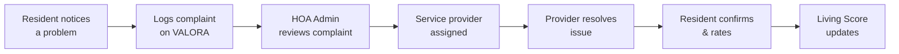
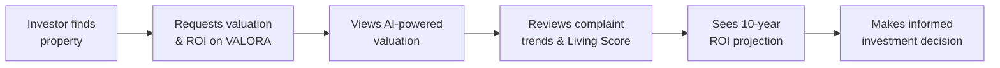
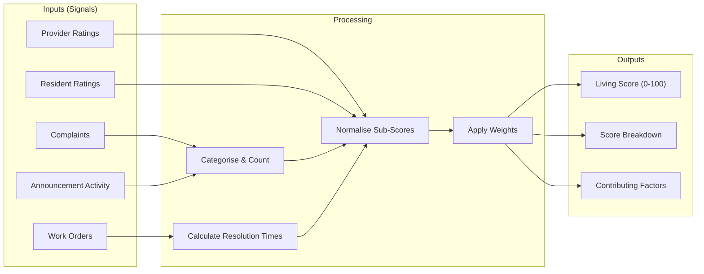
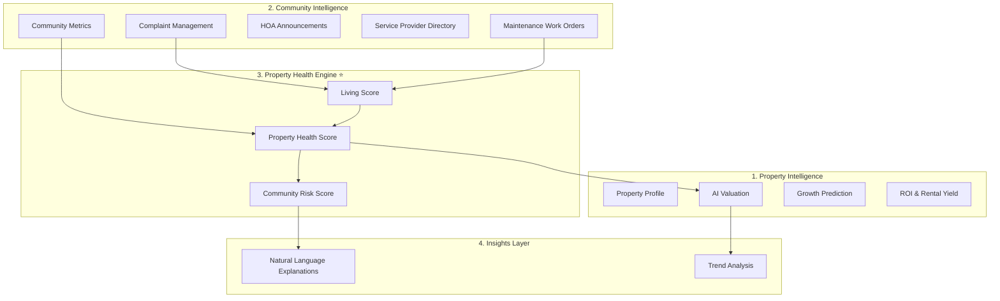

# VALORA — Product Requirements Document (PRD)

> **Version:** 1.1  
> **Date:** 15 July 2026  
> **Status:** Draft  
> **Author:** Group 8  

---

## Table of Contents

1. [Product Principles](#1-product-principles)
2. [Vision](#2-vision)
3. [Problem Statement](#3-problem-statement)
4. [Target Users](#4-target-users)
5. [User Personas](#5-user-personas)
6. [User Journeys](#6-user-journeys)
7. [MVP Features](#7-mvp-features)
8. [Property Health Engine Specification](#8-property-health-engine-specification)
9. [Future Features](#9-future-features)
10. [Success Metrics](#10-success-metrics)
11. [Competitive Positioning & Moat](#11-competitive-positioning--moat)
12. [System Boundaries](#12-system-boundaries)
13. [Technical Architecture](#13-technical-architecture)
14. [Glossary](#14-glossary)

---

## 1. Product Principles

Every feature, design decision, and technical trade-off in VALORA is evaluated through these five principles:

| # | Principle |
|---|---|
| 1 | **Every feature must improve Property Health Intelligence.** If it doesn't help users understand or improve the health of their property and community, it doesn't belong. |
| 2 | **Operational data is treated as an investment signal.** Complaints, resolution times, and provider ratings are not administrative overhead — they are inputs to valuation. |
| 3 | **Transparency builds stronger communities.** When residents can see how their estate is managed, accountability follows naturally. |
| 4 | **AI should explain its recommendations, not just predict them.** A score without a reason is marketing. A score with contributing factors is intelligence. |
| 5 | **Community quality is measurable.** What was previously hidden in WhatsApp groups and spreadsheets can be quantified, tracked, and improved. |

---

## 2. Vision

**VALORA** is **the first South African platform that quantifies how community management affects property value.**

It combines property valuation, community operations, and maintenance intelligence into a single system so that every stakeholder — residents, investors, estate agents, and HOA administrators — can understand not only *what a property costs*, but **why it's worth it**.

### Tagline

> *Know more than what a property costs. Know why it's worth it.*

### Core Innovation

Property value is not determined solely by bedrooms, bathrooms, and location. It is also influenced by **operational metrics**: security incident frequency, maintenance quality, HOA responsiveness, infrastructure condition, and resident satisfaction.

VALORA makes this relationship explicit through an interconnected value chain:

```
Community Events → Community Health → Property Health Score → Investment Intelligence
```

Every feature in the platform exists to measure or improve property health. Nothing is included "because it's required" — it's included because it is a **signal**.

---

## 3. Problem Statement

### The Problem

Residents, property owners, and HOA administrators currently rely on **disconnected systems** to:
- understand their property's value,
- report community issues,
- communicate with management, and
- monitor maintenance.

This fragmentation results in:
- **Poor investment decisions** — buyers cannot see operational health before purchasing.
- **Delayed issue resolution** — complaints live in WhatsApp groups, emails, and spreadsheets.
- **Reduced community transparency** — no single source of truth for how well a community is run.

### Where Information Hides Today

| Information | Where It Lives Now |
|---|---|
| Property price & specs | Property24, private agents |
| Sewage, security, infrastructure issues | WhatsApp groups, Facebook groups |
| Complaint history & resolution times | Emails, HOA meeting minutes |
| Maintenance quality & provider ratings | Word of mouth, spreadsheets |
| Resident satisfaction | Nowhere — unmeasured |

### What This Means

A buyer looking at a townhouse on Property24 can see **3 bedrooms and 2 bathrooms**. They **cannot** see that sewage blocks every week, security incidents happen monthly, and the HOA ignores complaints. Those hidden factors directly affect resale value, rental demand, and investor confidence — but **no platform combines them with property intelligence**.

### One-Sentence Problem

> VALORA solves the problem of fragmented property and community information by giving everyone with a long-term stake in a residential community a single trusted view of both the property's financial value and the community's operational health.

---

## 4. Target Users

| User Type | Relationship to Platform | Access Level |
|---|---|---|
| **Resident** | Lives in an estate; reports issues, views property data, receives announcements | Authenticated — read/write on own complaints |
| **Investor** | Evaluating or monitoring property as an investment | Authenticated — read-only (valuations, ROI, complaint trends) |
| **Estate Agent** | Lists properties, uses Living Score in marketing | Authenticated — listing data submission, Living Score read |
| **Casual Visitor** | Exploring, not committed; arrives via search or referral | Unauthenticated — free valuation estimate, suburb growth score |
| **HOA Administrator** | Manages the community; moderates complaints, verifies providers, posts announcements | Authenticated — admin privileges within their estate |
| **Service Provider** | Contracted to resolve maintenance work orders | Authenticated — receives assignments, submits completion notes |

---

## 5. User Personas

### 5.1 Thandi — The Concerned Resident

| Attribute | Detail |
|---|---|
| **Age** | 34 |
| **Role** | Resident & property owner |
| **Goal** | Wants her community to be well-managed and her investment protected |
| **Frustration** | Reported a burst pipe 3 weeks ago; no update. Has no idea if it affects her property value. |
| **VALORA value** | Logs complaints, tracks resolution, sees how community health impacts her property's Living Score. |

### 5.2 James — The Cautious Investor

| Attribute | Detail |
|---|---|
| **Age** | 45 |
| **Role** | Buy-to-let property investor |
| **Goal** | Wants data-driven insight before purchasing in a new estate |
| **Frustration** | Property24 shows price but nothing about how the estate is actually run. Relies on rumours. |
| **VALORA value** | Views 10-year ROI projections, complaint trend data, and the Living Score before committing capital. |

### 5.3 Nomsa — The Overworked HOA Admin

| Attribute | Detail |
|---|---|
| **Age** | 52 |
| **Role** | HOA committee chairperson (volunteer) |
| **Goal** | Wants to run the estate efficiently and show residents that management is responsive |
| **Frustration** | Drowning in WhatsApp messages, manual spreadsheets, and residents who feel unheard. |
| **VALORA value** | Centralised complaint dashboard, verified service provider directory, announcement system, and community health metrics that prove governance quality. |

### 5.4 David — The Estate Agent

| Attribute | Detail |
|---|---|
| **Age** | 29 |
| **Role** | Residential property agent |
| **Goal** | Wants a competitive edge when marketing properties |
| **Frustration** | All agents have the same listing data; nothing differentiates his pitch. |
| **VALORA value** | Can show buyers a property's Living Score and maintenance track record — something no competitor can offer. |

### 5.5 Lerato — The Curious Browser

| Attribute | Detail |
|---|---|
| **Age** | 26 |
| **Role** | First-time buyer, still researching |
| **Goal** | Wants to understand if a suburb is worth moving to |
| **Frustration** | No way to compare neighbourhood quality beyond "vibes" and anecdotal advice. |
| **VALORA value** | Gets a free valuation estimate and suburb growth score without signing up, which draws her into the platform. |

---

## 6. User Journeys

### 6.1 Resident: From Complaint to Resolution



**Steps:**
1. Resident logs into VALORA and submits a complaint (e.g., "Sewage overflow at Block C").
2. Complaint is logged with category, description, and timestamp.
3. HOA Admin reviews the complaint and either rejects it (with reason) or assigns a verified service provider.
4. A maintenance work order is created and the service provider is notified.
5. The provider starts work, marks it complete, and submits completion notes.
6. The resident receives a notification, confirms resolution, and rates the provider.
7. Resolution time, rating, and complaint frequency feed into the **Living Score** calculation.

### 6.2 Investor: From Interest to Decision



**Steps:**
1. Investor searches for a property or estate on VALORA.
2. Views the AI-generated valuation that incorporates market data **and** community health.
3. Reviews complaint trends (frequency, severity, resolution times) for the estate — read-only.
4. Checks the estate's Living Score and compares it with similar communities.
5. Reviews 10-year ROI projection and rental yield estimate.
6. Makes a purchase decision backed by operational intelligence, not just listing specs.

### 6.3 HOA Admin: Daily Operations

**Steps:**
1. Admin logs in and sees the complaint dashboard with pending, in-progress, and resolved items.
2. Reviews new complaints and assigns verified service providers from the directory.
3. Posts an announcement (e.g., scheduled water outage) to all estate residents.
4. Monitors community health metrics: average resolution time, complaint frequency trends, provider ratings.
5. Verifies or rejects new service provider applications.
6. Exports a governance report showing responsiveness improvements over time.

### 6.4 Casual Visitor: From Curiosity to Sign-Up

**Steps:**
1. Visitor lands on VALORA (via search or referral).
2. Enters an address or suburb to get a free valuation estimate.
3. Sees the suburb growth score.
4. Is prompted to sign up for deeper insights (Living Score, complaint data, ROI).
5. Converts to an authenticated Resident or Investor user.

---

## 7. MVP Features

> **Scope discipline:** The previous iteration of this PRD contained features equivalent to "three MSc projects." This version focuses the MVP on the **one value chain** that makes VALORA unique. Everything else is deferred to Phase 2+.

The MVP proves one thing: **community operations measurably affect property intelligence.**

```
Resident logs complaint → HOA resolves → Provider completes → Living Score updates → AI valuation uses Living Score
```

If this loop works, the product works. If it doesn't, nothing else matters.

### 7.1 Core Loop (MVP)

| Feature | Description | Why It's in the MVP |
|---|---|---|
| Property profile | Basic property data: address, size, bedrooms, bathrooms, unit/complex info | Foundation — everything references a property |
| Complaint submission & tracking | Residents log complaints; track status through lifecycle (Logged → Under Review → Assigned → In Progress → Resolved → Closed) | Primary signal source for the Living Score |
| Maintenance work orders | Complaints trigger work orders assigned to verified providers | Measures operational quality (resolution time, cost, rating) |
| Service provider directory | Verified, rated provider listing; HOA approval workflow | Better contractors → faster resolution → higher Living Score |
| HOA announcements | Admins post announcements visible to all estate residents | Replaces WhatsApp/email; governance activity signal |
| **Living Score** ⭐ | Weighted composite score (0–100) calculated from community operational data | **The differentiator.** See §8 for full specification. |
| AI-powered valuation | Predicted market value using market data **+ Living Score** | Proves the core thesis: community health affects property value |

### 7.2 What Is Explicitly NOT in the MVP

These are good features. They are not first.

| Feature | Why It's Deferred |
|---|---|
| Growth prediction (suburb-level) | Requires aggregated market data across suburbs — not available at launch |
| Rental yield estimate | Derivative of valuation; adds complexity without proving the core thesis |
| 10-year ROI projection | Requires historical trajectory data that won't exist until the platform has run for months |
| Property Health Score (property-level) | Depends on mature Living Score data; premature without estate-level validation |
| Community Risk Score | Requires multi-estate comparative data |
| Natural language insights ("Why did my valuation decrease?") | High UX value but requires a working Living Score + valuation pipeline first |
| Community metrics dashboard | Can be built after data accumulates; not needed to prove the loop |

---

---

## 8. Property Health Engine Specification

> *"If I'm your lecturer I'd ask: 'Okay... so what exactly is a Living Score?' And you'd be stuck."*
>
> This section ensures nobody is stuck. The Living Score is **engineering, not marketing.**

### 8.1 Living Score — Mathematical Definition

The **Living Score** is a weighted composite index (0–100) representing the quality of life in a residential estate. It is calculated per estate and updated on a rolling 90-day window.

#### Formula

```
Living Score = (W₁ × S_resolution) + (W₂ × S_frequency) + (W₃ × S_security) + (W₄ × S_satisfaction) + (W₅ × S_infrastructure)
```

#### Component Weights

| Weight | Component | Description | Score Range |
|---|---|---|---|
| **W₁ = 0.30** | Complaint Resolution Time (`S_resolution`) | Average days to move a complaint from "Logged" to "Closed", normalised against a benchmark (e.g., 5 business days = 100, 30+ days = 0) | 0–100 |
| **W₂ = 0.25** | Complaint Frequency (`S_frequency`) | Number of complaints per unit per 90-day window, inverse-normalised (fewer = higher score) | 0–100 |
| **W₃ = 0.20** | Security Incidents (`S_security`) | Complaints categorised as "Security", normalised by estate size | 0–100 |
| **W₄ = 0.15** | Resident Satisfaction (`S_satisfaction`) | Average `resident_rating` on closed work orders (1–5 scale, mapped to 0–100) | 0–100 |
| **W₅ = 0.10** | Infrastructure Maintenance (`S_infrastructure`) | Ratio of resolved vs. open maintenance work orders + average provider rating | 0–100 |

#### Normalisation

Each sub-score is normalised to 0–100 using min-max scaling against configurable benchmarks:

```
S_component = max(0, min(100, ((raw_value - worst_benchmark) / (best_benchmark - worst_benchmark)) × 100))
```

> **Note:** For inverse metrics (complaint frequency, security incidents), `best_benchmark` is the lower value.

#### Example Calculation

| Component | Raw Value | Benchmark (Best / Worst) | Sub-Score | Weighted |
|---|---|---|---|---|
| Resolution Time | 3.2 days | 1 day / 30 days | 92.4 | 27.7 |
| Complaint Frequency | 0.8 per unit | 0 / 5 per unit | 84.0 | 21.0 |
| Security Incidents | 2 in 90 days | 0 / 15 | 86.7 | 17.3 |
| Resident Satisfaction | 4.1 / 5 | 5 / 1 | 77.5 | 11.6 |
| Infrastructure Maintenance | 88% resolved, avg rating 4.0 | 100% / 0% | 88.0 | 8.8 |
| | | | **Living Score** | **86.4** |

### 8.2 How Scores Are Used

| Score | Scope | Calculated | Feeds Into |
|---|---|---|---|
| **Living Score** | Per estate | MVP — rolling 90-day window | AI Valuation model, Insights Layer |
| **Property Health Score** | Per property | Phase 2 — requires property-specific condition data | Investment reports |
| **Community Risk Score** | Per estate (trend) | Phase 2 — requires multi-month trend data | Risk alerts, comparative benchmarks |

### 8.3 Inputs → Processing → Outputs



### 8.4 Rule Engine (MVP)

Before ML is mature, the Living Score uses a **rule-based engine** with the weighted formula above. This is intentional:

- Rules are explainable (Principle 4: "AI should explain its recommendations")
- Rules work from day one with zero training data
- Rules can be validated by lecturers and stakeholders
- ML models can be introduced in Phase 2 to learn optimal weights from actual outcome data (e.g., correlation between Living Score and actual sale prices)

### 8.5 ML Roadmap (Post-MVP)

| Phase | Model | Purpose |
|---|---|---|
| Phase 2 | Weight optimisation (regression) | Learn optimal W₁–W₅ from correlation with property sale outcomes |
| Phase 2 | Anomaly detection | Identify estates with sudden score drops for Community Risk Score |
| Phase 3 | Valuation adjustment model | Multi-input model: market data + historical sales + Living Score → adjusted valuation |
| Phase 3 | Predictive maintenance | Forecast maintenance issues from complaint patterns |

---

## 9. Future Features

These features are **not** in the MVP. They are tracked here to prevent scope creep while preserving good ideas.

| Feature | Phase | Rationale for Deferral |
|---|---|---|
| Growth prediction (suburb-level) | Phase 2 | Requires aggregated historical market data across suburbs |
| Rental yield estimate | Phase 2 | Derivative of valuation; adds complexity without proving core thesis |
| 10-year ROI projection | Phase 2 | Requires months of platform data for meaningful projections |
| Property Health Score (per-property) | Phase 2 | Depends on mature Living Score + property-specific condition data |
| Community Risk Score | Phase 2 | Requires multi-estate comparative data and trend analysis |
| Community metrics dashboard | Phase 2 | Can be built once operational data accumulates |
| Natural language insights | Phase 2 | Requires working Living Score + valuation pipeline |
| Comparative estate benchmarking | Phase 2 | Needs data from multiple onboarded estates |
| Resident-to-resident messaging | Phase 3 | Not core to health intelligence; high complexity |
| Levy / financial management for HOAs | Phase 3 | Valuable but separate product concern |
| Push notifications (mobile) | Phase 3 | Requires mobile app or PWA infrastructure |
| AI chatbot for property queries | Phase 3 | Requires trained model and conversational UI |
| Integration with Property24 / external listing APIs | Phase 3 | API availability and partnership dependent |
| Municipal services integration (water, electricity) | Phase 3 | Requires government data partnerships |
| Predictive maintenance alerts | Phase 3 | Needs sufficient historical work order data for ML training |
| Multi-language support | Phase 3 | Audience expansion after product-market fit |

---

## 10. Success Metrics

### North Star Metric

**Active estates with a Living Score calculated and updated within the last 30 days.**

This single metric proves that the core value chain — from complaints to community health to property intelligence — is working.

### Supporting Metrics

| Category | Metric | Target (6 months post-launch) |
|---|---|---|
| **Adoption** | Registered estates | ≥ 5 estates onboarded |
| **Adoption** | Active residents per estate | ≥ 40% of estate residents |
| **Engagement** | Complaints logged per month per estate | Tracking baseline (no arbitrary target) |
| **Quality** | Average complaint resolution time | ≤ 5 business days |
| **Quality** | % complaints reaching "Closed" status | ≥ 70% |
| **Intelligence** | Valuation requests per month | ≥ 50 |
| **Intelligence** | Investor views of Living Score | Tracking baseline |
| **Conversion** | Casual visitor → registered user | ≥ 10% |
| **Satisfaction** | Average service provider rating | ≥ 3.5 / 5 |

---

## 11. Competitive Positioning & Moat

### Blue Ocean Positioning

| Platform | Competes On | Data It Has |
|---|---|---|
| **Property24** | Listings | House, price, location, bedrooms |
| **HOA software** | Management | Complaints, levies, notices |
| **VALORA** | **Intelligence** | Average repair time, complaint density, governance quality, maintenance history, provider performance, resident sentiment, infrastructure reliability |

VALORA occupies a space **between** listing platforms and HOA tools. It is not competing with either — it is building on a **fundamentally different dataset**.

### The Moat Question

> *"Why can't Property24 just add a Living Score?"*

**Answer:** Because Property24 doesn't have the data.

The Living Score is computed from **operational community data** — complaint resolution times, maintenance work order history, provider ratings, resident satisfaction scores, and governance activity. This data only exists inside the communities that use VALORA.

Property24 knows **what a house looks like**. VALORA knows **what it's like to live there**.

That is the moat: the data is generated by the platform's users as a natural byproduct of managing their community. The more estates that use VALORA, the richer the dataset, and the harder it is for a competitor to replicate.

### Defensibility Layers

| Layer | Description |
|---|---|
| **Data network effect** | More estates → more signals → better scores → more trust → more estates |
| **Proprietary scoring model** | Living Score formula and weightings are tuned on real community data |
| **Community lock-in** | HOA admins who adopt VALORA for daily operations create switching costs |
| **First-mover in SA** | No South African platform currently quantifies community management impact on property value |

---

## 12. System Boundaries

### What VALORA Is

- The **first South African platform that quantifies how community management affects property value**
- A system that connects property valuation with community management data
- An AI-powered analytics engine that transforms complaints and operational data into actionable scores

### What VALORA Is Not

- ❌ A property listing platform (not competing with Property24)
- ❌ A general-purpose community social network
- ❌ A financial/levy management system for HOAs
- ❌ A property marketplace with buy/sell transactions
- ❌ A replacement for emergency services or municipal reporting

### External Systems

| System | Interaction | Direction |
|---|---|---|
| Municipal Valuation Registry | Market & valuation data feed | Inbound → VALORA |
| (Future) Property listing APIs | Listing data enrichment | Inbound → VALORA |

### User Roles & Permissions Summary (MVP)

| Action | Resident | Investor | Estate Agent | Casual Visitor | HOA Admin | Service Provider |
|---|---|---|---|---|---|---|
| View property data | ✅ | ✅ | ✅ | Limited | ✅ | ❌ |
| Submit complaint | ✅ | ❌ | ❌ | ❌ | ❌ | ❌ |
| Track own complaints | ✅ | ❌ | ❌ | ❌ | ✅ (all) | ❌ |
| View complaint trends | ❌ | ✅ (read-only) | ❌ | ❌ | ✅ | ❌ |
| View valuation & ROI | ✅ | ✅ | ✅ | Free estimate only | ✅ | ❌ |
| View Living Score | ✅ | ✅ | ✅ | ❌ | ✅ | ❌ |
| Submit listing data | ❌ | ❌ | ✅ | ❌ | ❌ | ❌ |
| Verify service providers | ❌ | ❌ | ❌ | ❌ | ✅ | ❌ |
| Post announcements | ❌ | ❌ | ❌ | ❌ | ✅ | ❌ |
| Receive work orders | ❌ | ❌ | ❌ | ❌ | ❌ | ✅ |
| Submit completion notes | ❌ | ❌ | ❌ | ❌ | ❌ | ✅ |

---

## 13. Technical Architecture

### 13.1 Module Organisation

Modules are organised around the product vision, not generic CRUD concerns.



### 13.2 Data Pipeline

Every complaint is a signal. The system transforms raw operational data into property intelligence.

```
Complaint → Analytics → Community Health → Living Score → Valuation Adjustment
```

### 13.3 AI / ML Pipeline

The ML model for property valuation is differentiated by its inputs:

| Traditional Valuation Inputs | + VALORA's Unique Inputs |
|---|---|
| Market data | Community health metrics |
| Historical sales | Complaint trends |
| Location / size / specs | Maintenance quality (resolution time, provider ratings) |
| | Resident satisfaction signals |

**Output:** Adjusted Property Valuation that reflects both market conditions and operational health.

### 13.4 Data Model Summary

The following entities form the core data model (see [VALORA_3.8_Data_Models_Mermaid.md](file:///C:/Users/garah/PycharmProjects/Paliamentry%20LLM/VALORA/docs/VALORA_3.8_Data_Models_Mermaid.md) for full ERD):

| Entity | Purpose |
|---|---|
| `roles` | User role definitions (Resident, Investor, Estate Agent, Casual Visitor, HOA Admin) |
| `users` | Registered user accounts |
| `properties` | Property profiles (address, size, unit, complex) |
| `historical_market_data` | Market valuation records over time |
| `ai_analytics` | AI-generated scores: predicted value, rental yield, growth, ROI, **Living Score** |
| `complaints` | Resident-submitted complaints with category, status, timestamps |
| `maintenance_work_orders` | Work orders triggered by complaints; tracks assignment, resolution, cost, rating |
| `service_providers` | Verified provider directory with specialisation and average rating |
| `announcements` | HOA announcements with title, body, active status |

### 13.5 Complaint Lifecycle (State Machine)

```
[New] → Logged → Under Review → Assigned → In Progress → Resolved → Closed
                       ↓                                      ↓
                   Rejected                               Reopened → Assigned
```

Each state transition generates data that feeds the Property Health Engine.

---

## 14. Glossary

| Term | Definition |
|---|---|
| **Living Score** | A weighted composite index (0–100) representing quality of life in a residential estate. Calculated from: complaint resolution time (30%), complaint frequency (25%), security incidents (20%), resident satisfaction (15%), and infrastructure maintenance (10%). See §8 for full specification. |
| **Property Health Score** | *(Phase 2)* A property-level score that combines the estate's Living Score with property-specific condition data and valuation trajectory. |
| **Community Risk Score** | *(Phase 2)* A trend-based flag indicating estates where operational health is deteriorating — rising complaints, slowing resolutions, declining ratings. |
| **Property Health Engine** | The analytics engine that consumes community operational data and produces the Living Score (MVP), and later the Property Health Score and Community Risk Score (Phase 2). |
| **Signal** | Any event or data point (complaint, rating, resolution time) that the Property Health Engine uses to calculate scores. |
| **HOA** | Homeowners Association — the governing body of a private residential estate. |
| **Work Order** | A maintenance task triggered by a complaint and assigned to a verified service provider. |
| **Moat** | VALORA's competitive defensibility: operational community data that listing platforms (e.g., Property24) do not have and cannot acquire without running community management. |
| **Blue Ocean** | A market space with no direct competitor — VALORA competes on *property intelligence*, not listings or management. |

---

> **Next step:** The next document to produce is the **VALORA Analytics Engine Specification** — a deep-dive into the Property Health Engine covering inputs, processing, outputs, algorithms, weightings, ML models, rule engine, and feature engineering. That document becomes the **AI chapter** of the project.
>
> Every API endpoint, database migration, and UI component should trace back to a user problem defined in this PRD. If a feature cannot be linked to a section of this document, it probably doesn't belong in the MVP.
